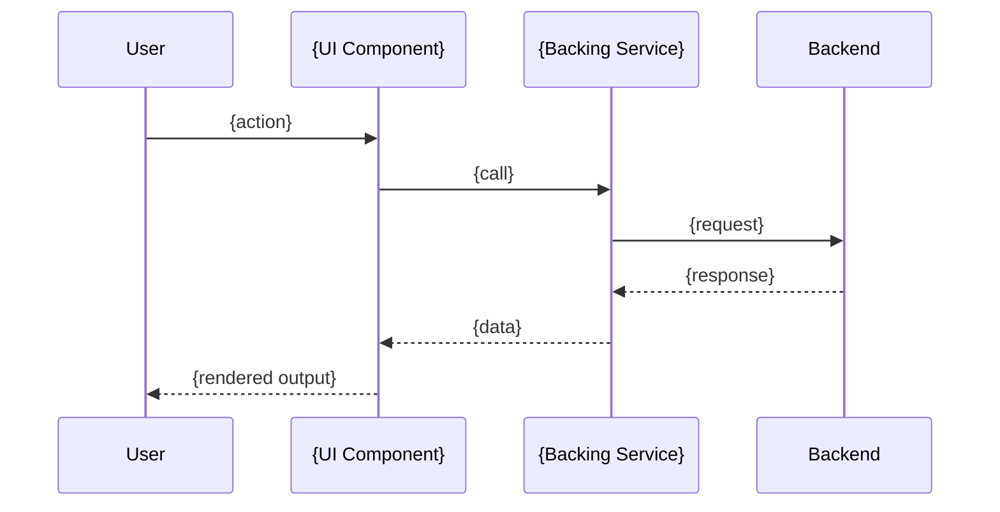

# Core Flows — {Topic Title}

> **What this document is**
>
> **User-facing flows and state transitions**, phrased in product language.
> Answers "what does the user see and do, and how does the system respond?".
>
> Audience: UX reviewer + implementer + QA. Reads like a verbose user story
> with wireframes / sequence diagrams / state machines.
>
> Include ASCII wireframes for visual reference. Include Mermaid diagrams for
> state and sequence.
>
> Delete this instruction block from the final document.

---

> **References:**
> - [Epic Brief](./Epic_Brief_—_{...}.md)
> - [Architecture Spec](./Architecture_Spec_—_{...}.md)

---

## Flow Overview

```mermaid
stateDiagram
  [*] --> {InitialState}: {entry trigger}
  {InitialState} --> {Next}: {user action}
  {Next} --> {Final}: {outcome}
  {Final} --> [*]
```

---

## Flow 1: {Flow name, e.g. "Open Video Player Dialog (Desktop)"}

**Trigger:** {what the user does or what event starts this flow}

**Preconditions:** {any required state — logged in, on a specific page, etc}

### Steps (from the user's perspective)

1. {what the user sees first}
2. {what they click / type / do}
3. {what the system does}
4. {what the user sees next}

### Desktop Wireframe (example — replace with a real one)

```wireframe
<!DOCTYPE html>
<html>
<head>
<style>
  body { background: #f0f0f0; font-family: Arial, sans-serif; margin: 0; }
  .container { max-width: 1200px; margin: 20px auto; padding: 20px; }
  .box { border: 2px solid #333; padding: 16px; border-radius: 8px; background: #fff; margin-bottom: 12px; }
  .placeholder { color: #888; font-style: italic; }
</style>
</head>
<body>
  <div class="container">
    <div class="box"><span class="placeholder">[header]</span></div>
    <div class="box"><span class="placeholder">[main content]</span></div>
    <div class="box"><span class="placeholder">[footer / action buttons]</span></div>
  </div>
</body>
</html>
```

### Mobile Wireframe (if responsive matters)

```wireframe
...
```

### Sequence Diagram



### Error / Recovery Paths

- **{error state 1}** — {what the user sees, how to recover}
- **{error state 2}** — {...}

---

## Flow 2: {...}

{repeat the structure}

---

## Cross-Flow Concerns

### Keyboard Navigation

- {tab order, shortcuts, focus management}

### Accessibility

- {ARIA roles, screen reader behavior, contrast considerations}

### Loading / Empty / Error States

- {what appears when data is loading, missing, or fails}

### Responsive Breakpoints

- {mobile / tablet / desktop behavior differences}

---

## Out-of-Scope Flows

- {flow excluded from this epic} — {why}

---

## Links

- [Epic Brief](./Epic_Brief_—_{...}.md)
- [Architecture Spec](./Architecture_Spec_—_{...}.md)
- [Implementation Spec](./Implementation_Spec_—_{...}.md)
