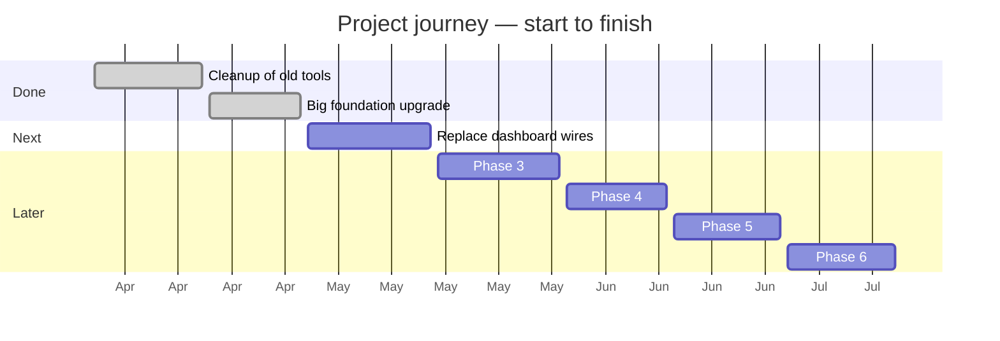

# {Project name in plain English} — Update for {Audience}

[← Back to README](../README.md)

> 📅 **Reporting period:** {Human-friendly period, e.g. "April 16 – April 28, 2026"}
> 👥 **For:** {Audience description, e.g. "non-technical readers / partners / friends-and-family"}
> ✍️ **Written:** {YYYY-MM-DD}

---

## 🎯 The 30-Second Version

> _One short paragraph in everyday language. Read this and you know the gist._
>
> {Example: "We're upgrading the engine of the website while it's still
> running, like changing the tires on a car going down the highway. This
> month we finished a big chunk: we swapped the old paint and trim (Bootstrap 4)
> for new paint and trim (Bootstrap 5) without anyone noticing. Everything
> still looks and works the same — that's the goal. Up next: replacing the
> dashboard wires (jQuery) with modern ones."_

---

## 🧭 What We Did This Period

> _Bullet list. Plain English. Each bullet starts with an action verb. No jargon._
> _If you must use a technical term, put it in **bold** and define it in the
> Glossary at the bottom._

- {Plain-English bullet 1 — e.g. "Updated the website's underlying styling library to a newer version. Think of it like upgrading from Windows 10 to Windows 11 — same look, but the modern foundation needed for everything that comes next."}
- {Plain-English bullet 2 — e.g. "Tested every page to make sure nothing visually changed for users."}
- {Plain-English bullet 3 — e.g. "Set up a tiny automated checker that catches a specific kind of mistake before it ever reaches users."}
- {Plain-English bullet 4 — e.g. "Wrote down clear instructions so future updates can follow the same careful process."}

---

## 🌟 What This Means for You

> _Translate the work into "why should the reader care". This is the most
> important section for non-technical audiences._

- **For users of the website:** {What they will / won't notice. e.g. "Nothing visible changes — that's the win. The site looks and behaves exactly as before, but underneath it's running on more modern parts."}
- **For the business:** {Plain language. e.g. "We're now ready to take the next steps in the long upgrade plan. Each step gets a little easier from here."}
- **For other team members:** {e.g. "The codebase is cleaner, with fewer outdated bits. Future bug fixes will be faster."}

---

## 🛣️ The Journey So Far

> _A simple visual that shows where we are along the path. Use a progress bar
> with filled and empty blocks, plus a Mermaid timeline if helpful._

**Overall progress:** `▰▰▱▱▱▱▱` **2 of 7 phases complete** _(roughly 28%)_

> _Tip: keep this Mermaid diagram simple — partners read it on phones too._

---

## 📊 By the Numbers

> _Translate raw metrics into something a 15-year-old can picture. Use
> comparisons, not jargon._

| What | Number | Plain-English meaning |
|------|-------:|------------------------|
| {e.g. Files updated} | {e.g. 110} | {e.g. About the same as renaming every chapter heading in a 110-chapter book — by hand, carefully, without changing the story.} |
| {e.g. Tests passing} | {e.g. 331 / 331} | {e.g. Every automatic safety check still works. Like every smoke detector in the house still beeping when it should.} |
| {e.g. Visible bugs introduced} | {e.g. 0} | {e.g. Zero things broke for users. That's the goal of "boring" work like this.} |
| {e.g. Build time} | {e.g. 7.7 seconds} | {e.g. Faster than making instant noodles. The whole site rebuilds in under 8 seconds.} |

---

## 🚀 What's Coming Next

> _Plain-language preview of the next step or two. Avoid technical detail._

**Next up: {Title of the next ticket / phase, in plain English}**

- {Plain-English description of what the next step does}
- {Why it matters in plain language}
- {Approximate timing if known, otherwise "starting next week"}

**After that:** {Brief gesture at the step beyond next.}

---

## 📖 Glossary _(optional — only if you used unavoidable jargon above)_

> _Each entry: term in bold, then a sentence anyone could understand._

- **Bootstrap** — a popular kit of pre-made styling and components that
  websites use, so that every site doesn't have to build buttons and
  layouts from scratch. Like LEGO blocks for web pages.
- **jQuery** — an old helper library websites use to make things move and
  react when you click. Modern websites have built-in tools for that now,
  so we're switching over.
- **Build** — turning the source code into the actual website files that
  load in your browser. Like turning a recipe into a meal.

---

## 💬 Questions?

> _Always end with an invitation. Non-technical readers shouldn't feel they
> can't ask "dumb" questions._

If something here didn't make sense, please ask — there are no silly
questions.

---

> 🔗 **For the technically curious:** the engineering details for this period
> live in [`{topic}/CHANGELOG.md`](./CHANGELOG.md) and [`{topic}/WORK_LOG.md`](../WORK_LOG.md).
> _(Linked for reference — you don't need to read them.)_
