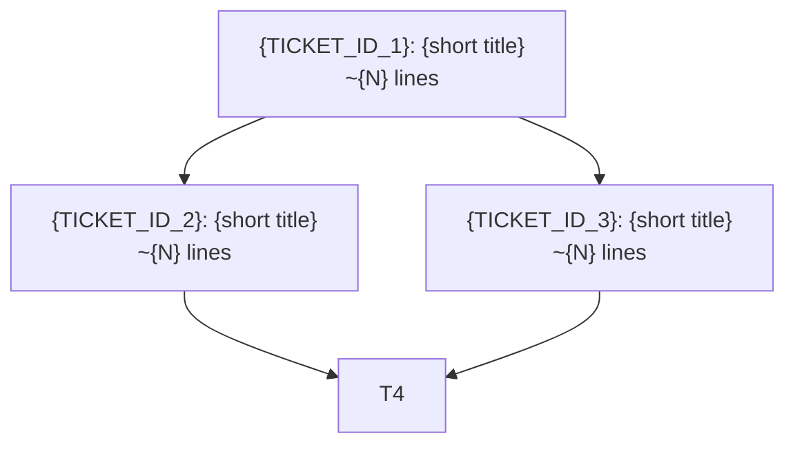

# Execution Plan — Ticket Breakdown, Sizing & Dependency Map for {Topic Title}

> **What this document is**
>
> The **execution-level plan** that bridges the Implementation Spec into
> sized, ordered, dependency-mapped tickets.
>
> Answers "how do we slice this into tickets that are each small enough to
> complete in one pass, and in what order?".
>
> Captures the **rationale behind ticket boundaries**, the **measured line
> counts** that drove sizing, and the **parallelization strategy**.
>
> This is the document that the ticket-generation workflow consumes to emit
> one ticket file per phase / workstream.
>
> Delete this instruction block from the final document.

---

> **References:**
> - [Architecture Spec](./Architecture_Spec_—_{...}.md)
> - [Implementation Spec](./Implementation_Spec_—_{...}.md)

---

## 1. Purpose

{1–2 paragraphs. What does this document enable? Typically: "bridge the
architecture and implementation specs into sized, ordered, dependency-mapped
tickets. Drives which work is serial vs parallel."}

---

## 2. File Inventory — Measured Line Counts

Every file that is created, modified, or deleted in this Epic is measured so
tickets stay under a target line budget (default: **500 lines changed per
ticket**; adjust per project).

### Files to Create

| File (new) | Est. Lines | Ticket |
|------------|-----------:|--------|
| `file:{path}` | ~{N} | {TICKET_ID} |

### Files to Modify

| File (existing) | Current Lines | Change Weight | Ticket |
|-----------------|-------------:|:-------------:|--------|
| `file:{path}` | {N} | High/Med/Low | {TICKET_ID} |

### Files to Delete

| File (to retire) | Current Lines | Ticket |
|------------------|-------------:|--------|
| `file:{path}` | {N} | {TICKET_ID} |

---

## 3. Ticket Dependency Map

Visualize which tickets block which, and which can run in parallel.

---

## 4. Parallelization Strategy

| Ticket | Can Start After | Can Run In Parallel With |
|--------|-----------------|--------------------------|
| {TICKET_ID_1} | — | — |
| {TICKET_ID_2} | {TICKET_ID_1} | — |
| {TICKET_ID_3} | {TICKET_ID_1} | **{TICKET_ID_2}** |
| {TICKET_ID_4} | {TICKET_ID_2} + {TICKET_ID_3} | — |

{Explain any non-obvious parallelization rationale in prose after the table.}

---

## 5. Sizing Summary

| Ticket | Lines Changed | File Count | Under {budget}? |
|--------|--------------:|-----------:|:---------------:|
| {TICKET_ID_1} | ~{N} | {count} | ✅ / ⚠️ |

{If any ticket exceeds the budget, explain the rationale and note what would
need to split to bring it under. Acceptable exceptions: mass-renames across
N files where each edit is trivial.}

---

## 6. Ticket Inventory

One row per ticket to be generated. This table is the direct input to the
`/topic-specs-from-research` ticket-generation step.

| Ticket ID | Title | Scope | Owner Workstream | Risk | Est. Lines |
|-----------|-------|-------|------------------|:----:|-----------:|
| {TICKET_ID_1} | {title} | {1-line scope} | Workstream A | 🟢/🟡/🔴 | ~{N} |

---

## 7. Per-Ticket Scope Contracts

For each ticket, state the **minimum contract** that ticket must satisfy.
The ticket generator uses this as the seed for the ticket's `Scope & Objective`,
`Acceptance Criteria`, and `Verification Steps` sections.

### {TICKET_ID_1}

- **In scope:** {1-line list}
- **Out of scope:** {1-line list — usually deferred to a sibling ticket}
- **Key files:** {list from §2}
- **Acceptance criteria seeds:**
  - {binary-verifiable condition 1}
  - {binary-verifiable condition 2}
- **Verification seeds:**
  - {command / grep / test}

### {TICKET_ID_2}

{repeat}

---

## 8. Phase Structure (optional)

If the topic is large, group tickets into phases. Each phase may be a natural
merge boundary.

| Phase | Tickets | Purpose |
|-------|---------|---------|
| Phase 0 — {name} | {T-01, T-02} | {purpose} |
| Phase 1 — {name} | {T-03..T-07} | {purpose} |

---

## 9. Consumer / Migration Map

{Optional — only if this topic introduces a new service / component that
existing code must migrate onto. List every consumer that needs updating and
which ticket owns each.}

| Consumer file | Current dependency | New dependency | Ticket |
|---------------|-------------------|----------------|--------|
| `file:{path}` | {old service} | {new service} | {TICKET_ID} |

---

## 10. Risks & Open Questions

- **{risk}** — {mitigation or "deferred to {TICKET_ID}"}
- **{open question}** — {who should answer before execution starts}

---

## Links

- [Epic Brief](./Epic_Brief_—_{...}.md)
- [Architecture Spec](./Architecture_Spec_—_{...}.md)
- [Implementation Spec](./Implementation_Spec_—_{...}.md)
- [Core Flows](./Core_Flows_—_{...}.md)
